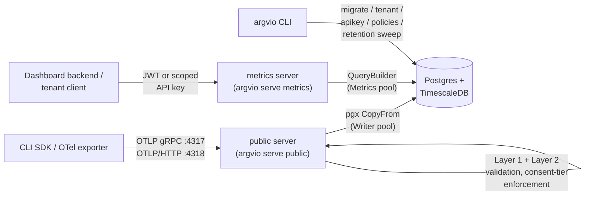

# Architecture

Argvio's data component is one Go module and one binary, `argvio`
(`cmd/argvio`), whose subcommands run two independent server processes
sharing a Postgres/TimescaleDB storage layer:

- **`argvio serve public`** — the OTLP ingest edge. Internet-facing,
  high-volume, write-heavy, untrusted input.
- **`argvio serve metrics`** — the query/analysis API. Internal/
  trusted-tenant-facing, low-volume, read-heavy.

## Why two processes, not two goroutines

Ingest must stay up and fast even when analytics queries are slow or the
query server is being redeployed, and a runaway/expensive analytical query
must never backpressure or degrade ingest. Both servers ship from the same
`argvio` binary, but `serve public` and `serve metrics` still run as
separate processes — splitting at the process level, not just logically
within one running program, means:

- **Separate failure domains.** `metrics` can crash, OOM, or be redeployed
  without `public` even noticing.
- **Separate connection pools** (`internal/config.StorageConfig.PublicPool`
  vs `MetricsPool`) — a slow dashboard query can never starve ingest of a
  Postgres connection, because it's drawing from a different pool entirely.
- **Separate scaling.** `public`'s traffic is proportional to CLI
  invocations across every tenant's users; `metrics`'s traffic is
  proportional to dashboard views. These do not scale together.
- **Separate network exposure.** `public` sits on the internet edge;
  `metrics` does not need to, and shouldn't.

## `public`: OTLP receiver

Implements the OTLP spec for metrics, logs, and traces over both gRPC
(`OTLP/gRPC`) and HTTP (`OTLP/HTTP`, protobuf and JSON), using
`go.opentelemetry.io/collector/pdata` and the generated
`go.opentelemetry.io/proto/otlp` types rather than hand-rolling the wire
format. Built against pdata v1.64.0 / the OTLP proto definitions vendored
at that version (see `go.mod`).

Request pipeline (`internal/otlp`), every stage assuming a hostile or buggy
client:

1. **Auth** (`internal/otlp/core.go`) — API key resolved via
   `internal/tenant.Cache`, an in-memory TTL cache in front of Postgres
   (`internal/tenant.Store`), so an unknown/revoked key is rejected before
   any OTLP parsing happens and a retry storm never reaches Postgres.
2. **Rate limiting** (`internal/ratelimit`) — per-tenant token buckets
   (requests/sec and bytes/sec), checked immediately after auth.
3. **Layer 1: structural validation** (`internal/otlp/limits.go`,
   `attrs.go`) — batch size, attribute count/length, timestamp skew, all
   from config, not hardcoded. A batch-size violation rejects the whole
   request; a per-attribute bound violation drops that attribute and keeps
   the record.
4. **Layer 2: semantic allowlist + consent tier** (`internal/allowlist`,
   `internal/consent`) — the record's event name must be on the versioned
   allowlist (or the whole record is rejected); its declared consent tier
   is capped at the tenant's configured ceiling; fields above the effective
   tier are stripped. See docs/allowlist.md.
5. **Write** (`internal/storage.Writer`) — accepted rows are batched per
   OTLP export request and written via `pgx.CopyFrom`.

Every rejection (whole-record or per-attribute) is logged with the reason
and the offending key names — never the raw values, since an unrecognized
or over-tier attribute may itself be the sensitive thing being rejected.

Responses use OTLP's `PartialSuccess` mechanism: an export request that's
partially accepted returns 200/OK with `rejected_spans` /
`rejected_data_points` / `rejected_log_records` populated, not a bare
failure. A whole-request structural rejection (oversized batch, disabled
signal type) returns the appropriate gRPC status
(`InvalidArgument`)/HTTP status (400) instead.

## `metrics`: query/analysis API

REST, not GraphQL — see the doc comment on `internal/metricsapi` for the
tradeoff. Every query is built through
`internal/storage.QueryBuilder`, which only accepts a `storage.TenantScope`
(constructed once, immediately after auth resolves the caller's tenant) —
there is no method on `QueryBuilder` that can run without one, so tenant
isolation is a type-system guarantee, not a code-review convention. See
docs/schema.md for what's backing each query.

Auth is JWT (dashboard-user session, HS256, `tenant_id` claim) or a scoped
API key (`scope=metrics_query`, distinct from `public`'s ingest keys) —
`internal/config.AuthMode`. Full endpoint/parameter/response reference:
`openapi/openapi.yaml`.

## OTLP spec version

Built against `go.opentelemetry.io/proto/otlp` v1.11.0 / `pdata` v1.64.0
(see `go.mod` for exact pinned versions). `public` does not ship its own
OpenAPI spec — it's OTLP-spec-compliant by definition, not a bespoke REST
API.

## Non-goals (out of scope for this component)

No frontend/dashboard UI, no billing/plan enforcement, no tenant
onboarding UI (use the `argvio` operator CLI), no CLI-side SDK/exporter
code.
