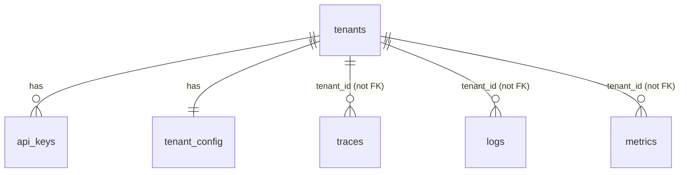

# Schema

Migrations live in `migrations/` (plain numbered `.sql` files, run via
`golang-migrate`'s pgx driver — `internal/storage/migrate.go` embeds them
so `argvio-admin migrate` needs no external tooling). Requires the
`timescaledb` **and** `timescaledb_toolkit` Postgres extensions — see
"Deployment prerequisite" below.

## `tenants`, `api_keys`, `tenant_config` (`migrations/0001`)

Plain (non-hypertable) tables — low volume, read on every ingest request
(via `internal/tenant.Cache`, never Postgres directly on the hot path).

| Table | Purpose |
|---|---|
| `tenants` | Identity: `id`, `slug`, `name`, `status` (active/suspended). |
| `api_keys` | `key_hash` (SHA-256; the raw key is shown once at creation and never stored), `key_prefix` (for admin display), `scope` (`public_ingest` or `metrics_query` — an ingest key cannot authenticate against `metrics`, and vice versa), `revoked_at`. |
| `tenant_config` | Runtime-tunable per-tenant overrides: `tier_ceiling`, `tier_enforcement_mode` (`strip`/`reject`), rate-limit overrides, retention-day overrides. One row per tenant, mutated via `argvio-admin tenant config`, never via static config files. |

`traces`/`logs`/`metrics` deliberately have **no foreign key** to
`tenants(id)` — FK validation on every row would add lock/lookup overhead
to the hottest write path in the system, and tenant existence is already
enforced upstream by `public`'s API-key lookup before any row is written.

## `traces`, `logs`, `metrics` (`migrations/0002`) — the hypertables

One row per span / log record / metric data point — close to the OTLP data
model (resource → scope → record), not flattened, but with the columns
every query actually filters/aggregates on pulled out of JSONB into real,
indexed columns:

`tenant_id`, `time`, `cli_version`, `os`, `arch`, `command_name`,
`exit_code`, `is_ci`, `consent_tier` — present on all three tables.
Everything else lives in JSONB (`resource_attributes` + one of
`span_attributes` / `log_attributes` / `datapoint_attributes`), with a GIN
index on each for ad hoc attribute filtering (`internal/otlp/pipeline.go`'s
`splitRemainingAttrs` is what decides promoted-column vs. JSONB per
attribute, driven by the allowlist schema).

Each is a **hypertable**, chunked by `time` (`chunk_time_interval` = 1 day)
and **space-partitioned by `tenant_id`** via `add_dimension` (8 hash
buckets — see "Tenant partitioning" below), since every query the metrics
server issues is tenant-scoped.

### Tenant partitioning

`add_dimension('traces', 'tenant_id', number_partitions => 8)` hashes
`tenant_id` into 8 buckets — **not** a 1-tenant-per-chunk mapping (that
doesn't scale as tenant count grows), but enough that the planner can
exclude chunks outside a queried tenant's bucket for the always-tenant-
scoped queries `QueryBuilder` issues. Revisit the bucket count as tenant
cardinality grows; changing it requires a new dimension (existing chunks
keep their original partitioning).

### Per-tenant retention

Timescale's `add_retention_policy` drops whole chunks past an age
threshold — but a chunk is time-range × tenant-hash-bucket, so it holds a
slice of *many* tenants. A retention policy therefore can only enforce one
(the longest-needed) window per hypertable, not a genuinely per-tenant one.

So: the global Timescale retention policy (`migrations/0004`, driven by
`StorageConfig.Traces/Logs/Metrics.RetentionAfter`) is the safety net sized
to the longest window any tenant needs. A tenant configured with a
*shorter* `tenant_config.retention_*_days` gets pruned early by
`argvio-admin retention sweep` (`internal/storage.SweepTenantRetention`), a
plain `DELETE ... WHERE tenant_id = $1 AND time < now() - N days` — meant
to run on a schedule (cron/systemd timer), not wired to any request path.

## Continuous aggregates (`migrations/0003`)

Three materialized views, `WITH (timescaledb.continuous)`, refreshed
hourly:

| View | Source | Grain | Backs |
|---|---|---|---|
| `cagg_command_stats_hourly` | `traces` (`cli.command.*` / `cli.subcommand.*` spans) | tenant × command × cli_version × os × arch × is_ci × hour | `LatencyPercentiles`, `ErrorRateSeries`, `CommandFrequency` (bucket=hour) |
| `cagg_command_stats_daily` | `cagg_command_stats_hourly` (hierarchical) | same, × day | same three, bucket=day — avoids rescanning raw `traces` for wide-range dashboard queries |
| `cagg_session_activity_daily` | `logs` (`cli.session.started`) | tenant × cli_version × os × is_ci × day | `SessionCohort` |

Percentiles use TimescaleDB Toolkit's `percentile_agg`/`approx_percentile`
(uddsketch-backed), not `percentile_cont` — continuous aggregates can only
incrementally combine aggregates that support partial-state rollup, which
`percentile_cont` doesn't; `percentile_agg` is purpose-built for this.
`rollup()` combines the sketch across the hourly→daily hierarchy and across
whatever dimensions a query collapses (e.g. filtering by `os` but not
`cli_version` sums across `cli_version` values within a bucket).

`internal/storage/query.go`'s `commandStats` is the one query all three of
`LatencyPercentiles`/`ErrorRateSeries`/`CommandFrequency` share — same
`GROUP BY`, different projection — rather than three near-duplicate SQL
strings.

## Compression + retention policies (`migrations/0004`)

| Table | Compress after | Retain (global) |
|---|---|---|
| `traces` | 7d | 30d |
| `logs` | 7d | 90d |
| `metrics` | 30d | ~400d |
| continuous aggregates | — | 90d (hourly) / 730d (daily rollups) |

Applied via migration at deploy time, and re-appliable idempotently via
`argvio-admin policies apply` (`internal/storage.ApplyRetentionAndCompressionPolicies`)
whenever `StorageConfig`'s per-signal windows change — it removes then
re-adds each policy, since Timescale's `add_*_policy` doesn't update an
existing job's schedule in place. `compress_segmentby` is
`(tenant_id, command_name)` / `(tenant_id, event_name)` / `(tenant_id, metric_name)`
respectively, matching the columns dashboard queries actually filter by.

## Deployment prerequisite

Requires the `timescaledb` **and** `timescaledb_toolkit` Postgres
extensions available in the target environment — e.g. Timescale Cloud,
self-hosted with both extensions installed, or the
`timescale/timescaledb-ha` container image (bundles both; the plain
`timescale/timescaledb` image does not include Toolkit). `migrations/0002`
issues `CREATE EXTENSION IF NOT EXISTS` for both, so a mismatched
environment fails fast at `argvio-admin migrate up`, not at first query.
